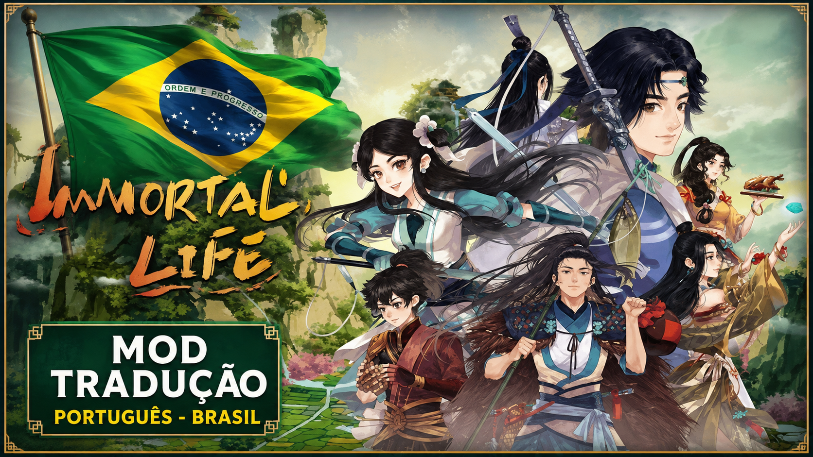
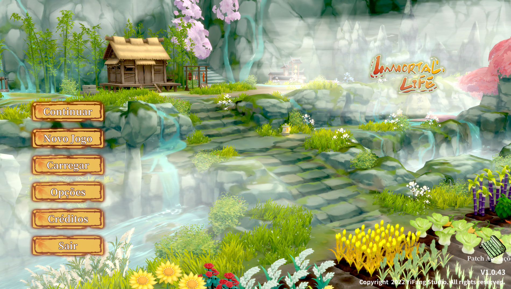
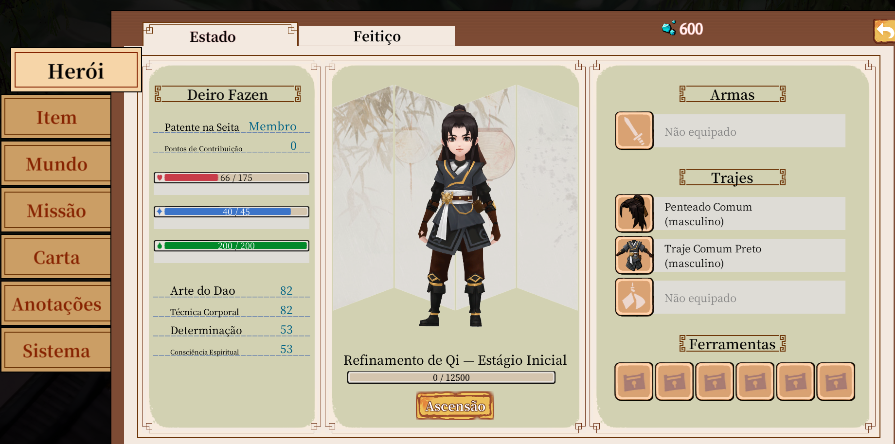
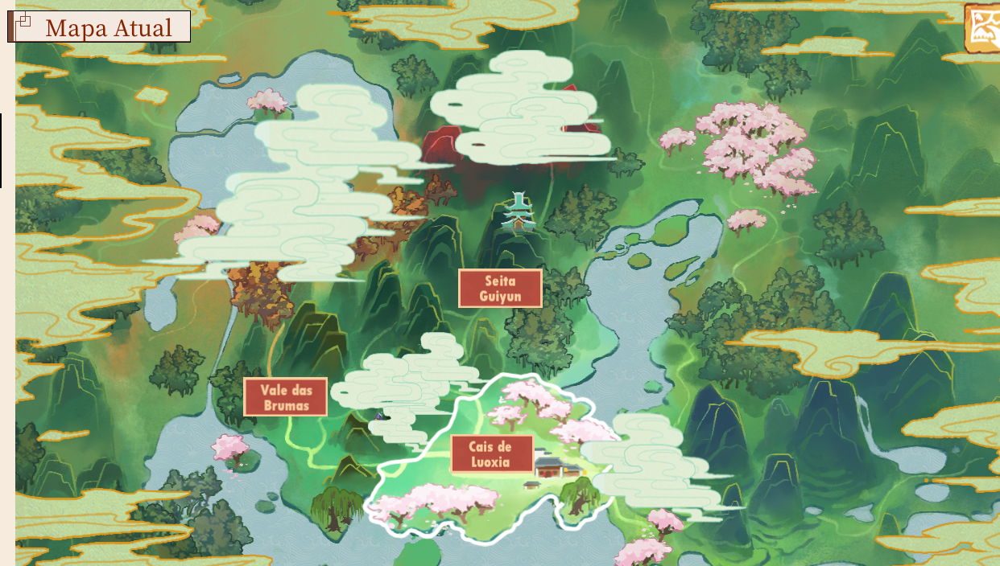
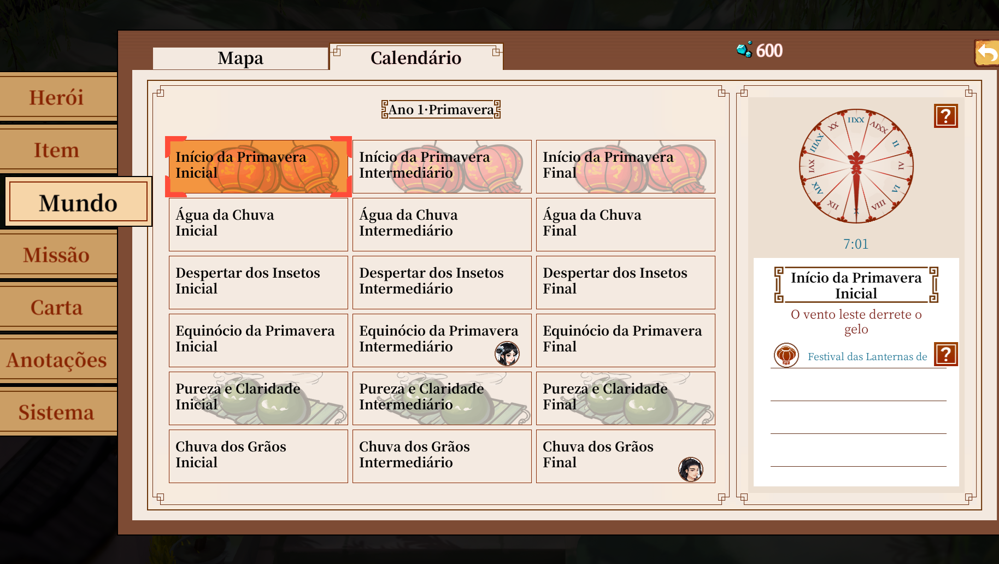
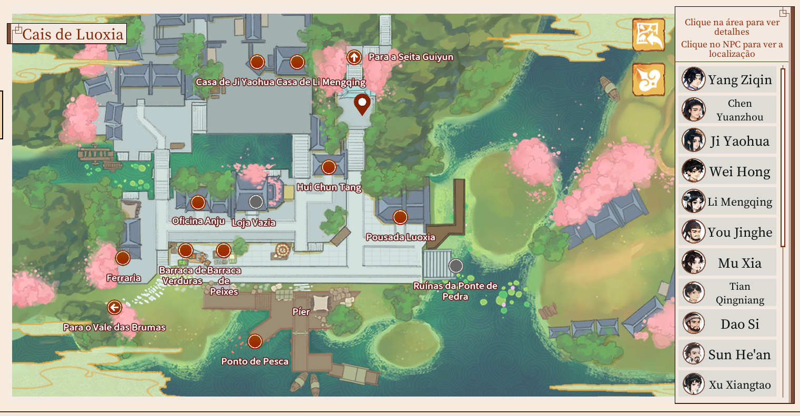
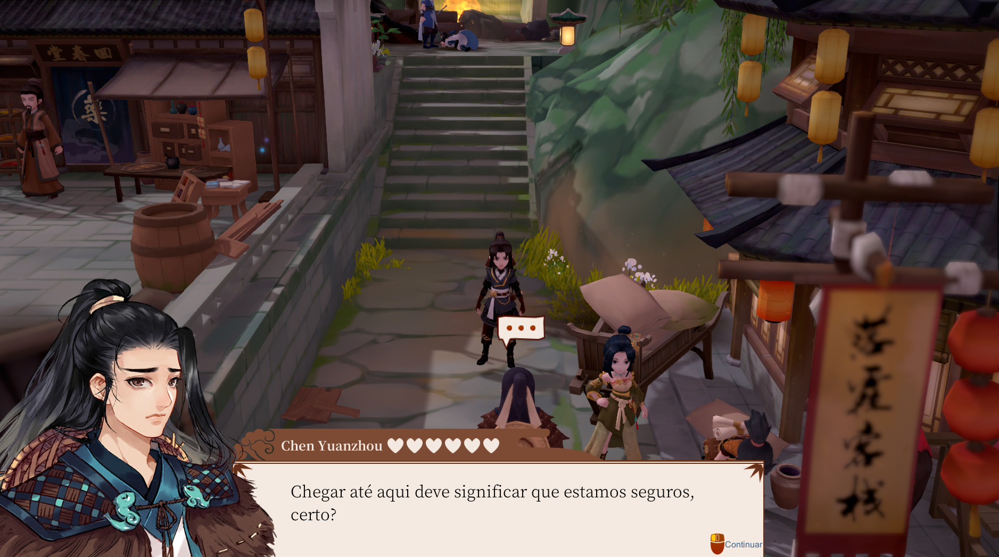

<div align="center">

# Immortal Life - Tradução Português Brasileiro


</div>

Este repositório contém a tradução completa do **Immortal Life** para o português brasileiro.

---

## ✨ Veja o Mod em Ação

<div align="center">

### 🎬 Immortal Life em Português Brasileiro

[](https://store.steampowered.com/app/1201230/Immortal_Life/)

**🌾 Cultive, explore e viva a fantasia de Immortal Life com tradução completa em PT-BR.**  
**🔥 Mais imersão, mais acessibilidade, a mesma aventura que você ama — agora no seu idioma.**

[➡️ Ver página oficial na Steam](https://store.steampowered.com/app/1201230/Immortal_Life/)  
[➡️ Baixar no Nexus Mods](https://www.nexusmods.com/immortallife/mods/13)

</div>

---

## 🖼️ Screenshots da Tradução

<div align="center">








</div>

> 💡 *Imagens da tradução em funcionamento dentro do jogo.*

---

## 📋 Conteúdo do Projeto

- **mod_immortal_life_pt-br.emip** - Arquivo principal do mod traduzido
- **Language-resources.assets-17112-PTBR-final-REVISADO-v49.txt** - Arquivo de tradução final revisado (v49)
- **Language-resources.assets-17112-Original.txt** - Arquivo de referência original em inglês
- **images/** - Diretório para capturas de tela e imagens do projeto

## 🎮 Sobre o Mod

O Immortal Life é um mod que adiciona novas mecânicas de sobrevivência e longevidade ao jogo, permitindo que os jogadores explorem novas dimensões de gameplay.

## 🔗 Página do Jogo na Steam

- **Immortal Life na Steam:** https://store.steampowered.com/app/1201230/Immortal_Life/

## 🇧🇷 Tradução

Este projeto fornece uma tradução completa e cuidadosamente revisada do mod para falantes de português brasileiro, garantindo que toda a experiência do jogo seja acessível em português.

### Versão Atual
- **v49** - Versão final revisada e otimizada

## 📂 Estrutura de Arquivos

```
.
├── mod_immortal_life_pt-br.emip              (Mod compilado em PT-BR)
├── Language-resources.assets-17112-PTBR-final-REVISADO-v49.txt  (Strings de tradução)
├── Language-resources.assets-17112-Original.txt                 (Referência original)
├── images/                                    (Screenshots e imagens)
└── README.md                                  (Este arquivo)
```

## 🚀 Como Usar

1. Baixe o arquivo `mod_immortal_life_pt-br.emip`
2. Coloque o arquivo na pasta de mods do seu jogo
3. Ative o mod nas configurações
4. Desfrute do Immortal Life em português brasileiro!

## 📝 Notas

- Este é um projeto de tradução comunitária
- A tradução foi revisada e otimizada para melhor localização
- Todos os textos e strings do jogo foram traduzidos

## 📧 Suporte

Para dúvidas, sugestões ou problemas com a tradução, abra uma issue neste repositório.

---

**Última atualização:** Agosto de 2026
